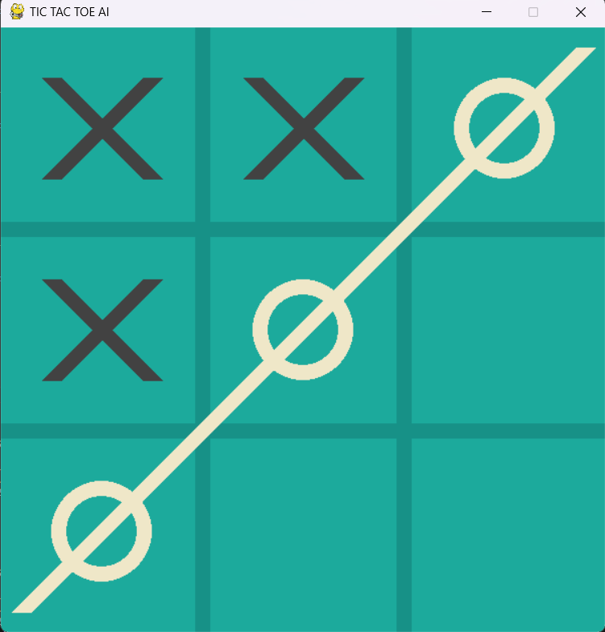
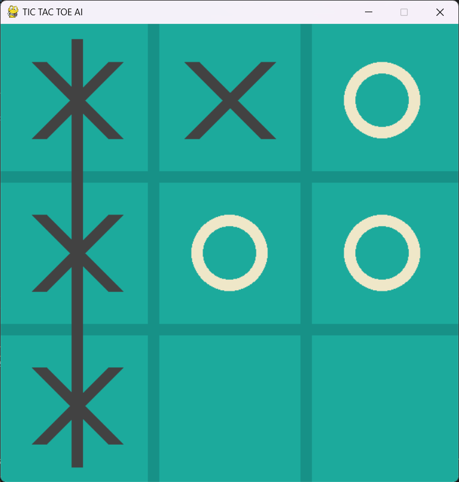

# Unbeatable Tic Tac Toe Game

This is a Python implementation of the classic Tic Tac Toe game, where you can play against an AI opponent that is unbeatable. The AI uses the minimax algorithm to make optimal moves and ensure it never loses.

## Game Instructions

1. Run the Python script `tictactoe.py` to start the game.
2. The game board will be displayed on the screen.
3. By default, the game is set to AI mode, where you play against the unbeatable AI opponent. You can switch to player vs. player mode by pressing the 'g' key on your keyboard.
4. In AI mode, you can change the AI level by pressing the '0' key to set it to random moves or the '1' key to set it to the impossible level.
5. To make a move, click on any empty square on the game board.
6. The AI opponent will automatically make its move after you make yours.
7. If you want to restart the game at any time, press the 'r' key on your keyboard.

Have fun playing Tic Tac Toe against the unbeatable AI opponent!

## Game Snapshots

### Snapshot 1 - Start

### Snapshot 2 - Circle Win

### Snapshot 3 - Cross Win

